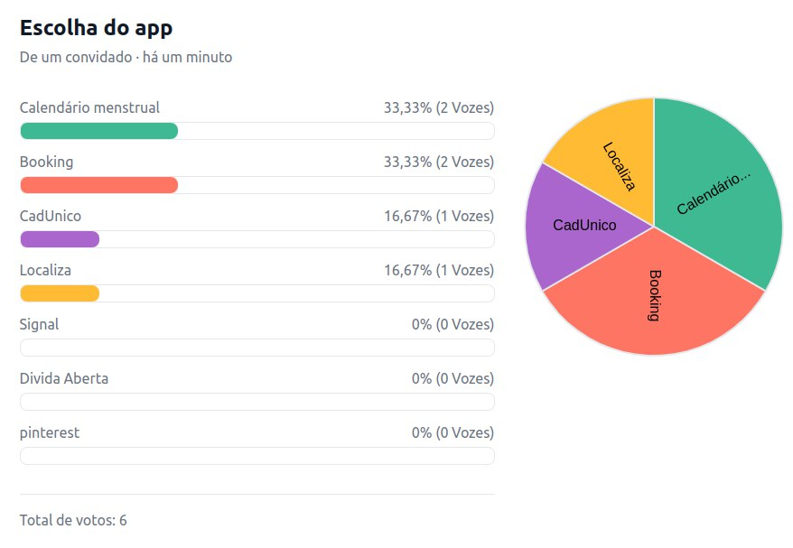
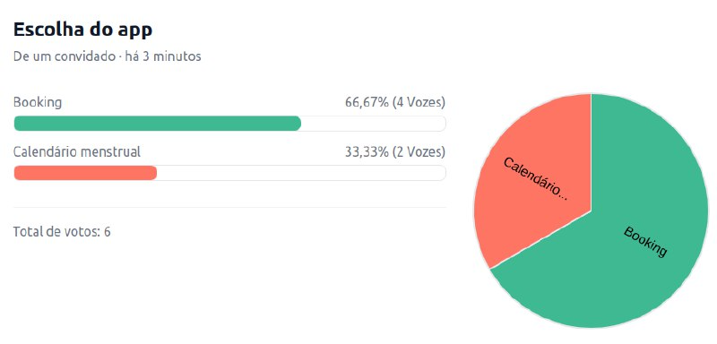

# Ata da reunião - 07/05/2023

## Dados da reunião

| Alunos presentes                                  | Data       | Horário de inicio e fim | Local |
| ------------------------------------------------- | ---------- | ------------------------ | ----- |
| Lucas, Gabriel, Chaydson, Samuel, Pedro, Henrique | 07/05/2023 | 21:00 - 22:30            | TEAMS |

## Objetivos da reunião

- Definição do aplicativo que a equipe irá trabalhar ao longo da disciplina
- Finalização do cronograma
- Deploy da aplicação
- Alinhamento da equipe sobre o projeto

## Aplicativo escolhido

Todos os participantes tiverem um tempo para mostrarem seu respectivo Rich Picture do aplicativo escolhido, ao final da apresentação de todos, foi feita um enquete para a escolha do melhor.

### Primeira votação

### Desempate

Portanto, ficou definido o aplicativo [Booking](https://play.google.com/store/apps/details?id=com.booking&hl=pt_BR&gl=US), como o escolhido para o seguimento da disciplina.

## Finalização do cronograma

Inicialmente se tinha apenas o cronograma inicial criado pelo membro Chaydson, finalizamos o cronograma planejado com a presença de toda a equipe, passando quem iria ficar responsável por x atividade e quem iria revisar esta atividade

O cronograma planejado se encontre em: [Cronograma Planejado](../planejamento/cronograma.md)

## Deploy da aplicação

Os membros Lucas e Chaydson ficaram responsáveis de gerar o deploy da aplicação para deixa-la disponível.

## Alinhamento da equipe sobre o projeto

Durante a reunião, foram esclarecidas diversas dúvidas que a equipe tinha, como exemplo: Horários, entregas, tarefas a serem feitas, entre outras.

## Link da gravação da reunião

A gravação se encontra em: [Gravação](https://unbbr.sharepoint.com/sites/Grupo02IHCRS/Documentos%20Compartilhados/RS/Recordings/Reuni%C3%A3o%20em%20_RS_-20230407_211717-Grava%C3%A7%C3%A3o%20de%20Reuni%C3%A3o.mp4?web=1)

## Histórico de Versão

| Versão | Data       | Descrição            | Autor(es)       | Revisor(es) |
| ------- | ---------- | ---------------------- | --------------- | ----------- |
| 1.0     | 01/04/2023 | Criação do documento | Lucas e Gabriel | Pedro       |
