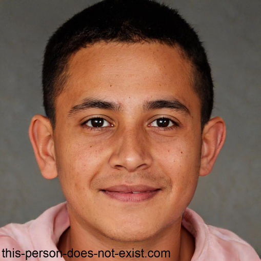

# Personas

## Introdução

Bem-vindo à página de personas do projeto! Aqui você encontrará uma lista de personas e antipersonas que serão utilizados para projeto. Essas personas são pessoas ficticias para definir nosso público-alvo, o qual forma selecionadas e baseadas no perfil de usuário, assim tendo base para definir as personas.

## Personas

|                                                                                                                                                                                                      |
| :--------------------------------------------------------------------------------------------------------------------------------------------------------------------------------------------------------------------------------------------------: |
|                                                                                                            **Nome:** Fernando Ribas                                                                                                            |
|                                                                                                             **Gênero:** Masculino                                                                                                             |
|                                                                                                                 **Idade: 20**                                                                                                                 |
|                                                                                                     **Escolaridade:** Superior incompleto                                                                                                     |
|                                                                                                          **Profissão:** Estagiário                                                                                                          |
|                                                                                                   **Relacionamentos:** Solteiro, sem filhos                                                                                                   |
|                                                                                                         **Status:** Persona primária                                                                                                         |
|                                                            **Objetivos:** Fernando Ribas é um jovem que ama viajar, pois ama conhecer novos lugares e aprender com outras culturas                                                            |
|                                **Habilidades:** Por ser tratar de um jovem, Fernando sempre teve contato com tecnologias desde cedo. Por isso, não tem dificuldades relacionadas ao uso de serviços virtuais                                |
| **Tarefas:** Durante o dia Fernando acorda e vai para a faculdade, depois de passar o dia estudando ele volta para casa para estagiar, pois ele trabalha de forma remota. Porém, durante as férias ele gosta de viajar para lugares bonitos. |
|                                                      **Requisitos:** Fernando gostaria que as reservas de hoteis e pousadas fossem menos burocráticas e feitas de maneira mais eficiente                                                      |
|                                                                      **Expectativas:** Ele acredita que o booking.com pode lhe dar as melhores promoções de hospedagem                                                                      |

|                                                                                                                                                                                  |
| :------------------------------------------------------------------------------------------------------------------------------------------------------------------------------------------------------------------------------: |
|                                                                                               **Nome:** Daniela Stella Melo                                                                                               |
|                                                                                                        Gênero: Feminino                                                                                                        |
|                                                                                                       **Idade: 31**                                                                                                       |
|                                                                                                 Escolaridade: Superior completo                                                                                                 |
|                                                                                                 **Profissão:** Arquiteta                                                                                                 |
|                                                                                         **Relacionamentos:** Casada e tem 2 filhos                                                                                         |
|                                                                                              **Status:** Persona secundária                                                                                              |
|          **Objetivos:** Daniela ama a sua família e preza muito por tempo de qualidade com eles. Por isso, nos feriados e fins de semana eles sempre alugam uma casa na praia para curtirem um momento juntos.          |
| **Habilidades:** Por razões profissionais ele acaba tendo muito contato com certos tipos de tecnologia. Porém ela considera valioso o tempo fora do celular, pois ela sente que nada substitui as relações presenciais |
|                  **Tarefas:** Ela trabalha em seu escritório de segunda à sexta feira e nos fins de semana ela arruma as malas, o seu marido faz as reservas de onde eles irão passar o fim de semana.                  |
|                                         **Requisitos:** Daniela gostaria que fosse possível adicionar companheiros de viagem para facilitar na hora de fazer a reserva do local.                                         |
|               **Expectativas:** Daniela acha que com o Booking.com a sua família terá mais segurança ao realizar a reserva, porque ficará mais fácil de fazer a gestão de pessoas que irão na viagem               |

|  |
| :----------------------------------------------: |
|                   Identidade:                   |
|                 **Nome:**                 |
|                 **Idade:**                 |
|              **Profissão:**              |
|            **Relacionamentos:**            |
|                **Status:**                |
|               **Objetivos:**               |
|              **Habilidades:**              |
|                **Tarefas:**                |
|               **Requisitos**               |
|             **Expectativas:**             |

## Antipersonas

|  |  |
| :----------------------------------------------: | - |
|                   Identidade:                   |  |
|                 **Nome:**                 |  |
|                 **Idade:**                 |  |
|              **Profissão:**              |  |
|            **Relacionamentos:**            |  |
|                **Status:**                |  |
|               **Objetivos:**               |  |
|              **Habilidades:**              |  |
|                **Tarefas:**                |  |
|               **Requisitos**               |  |
|             **Expectativas:**             |  |

## Referências

‌

‌

## Histórico de Versão

| Versão | Data       | Descrição                      | Autor(es)          | Revisor(es) |
| ------- | ---------- | -------------------------------- | ------------------ | ----------- |
| 1.0     | 23/04/2023 | Criação da página de personas | Chaydson e Gabriel | Lucas       |
