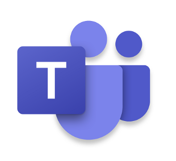
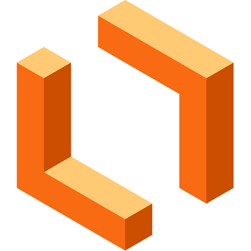

## Ferramentas

A tabela a seguir, Tabela 1, apresenta todas as ferramentas utilizadas no projeto, bem como sua aplicação em cada etapa correspondente.

| Logo                                                                       | Ferramenta                 | Etapa                                                          | Descrição                                                                                                                                                                                                                                                                                                           |
| -------------------------------------------------------------------------- | -------------------------- | -------------------------------------------------------------- | --------------------------------------------------------------------------------------------------------------------------------------------------------------------------------------------------------------------------------------------------------------------------------------------------------------------- |
| <figure></figure>   | GitHub                     | Todo o projeto                                                 | O GitHub é usado para hospedar o projeto em um repositório público.                                                                                                                                                                                                                                                |
|                          | Git                        | Todo o projeto                                                 | O Git é usado para controlar as versões do projeto.                                                                                                                                                                                                                                                                 |
|                     | Telegram                   | Todo o projeto                                                 | O Telegram é usado para a comunicação entre os colaboradores do projeto.                                                                                                                                                                                                                                           |
|                      | Discord                    | Todo o projeto                                                 | O Discord é usado para a comunicação por voz e texto entre os colaboradores do projeto.                                                                                                                                                                                                                            |
|                       | MkDocs                     | Todo o projeto                                                 | O MkDocs é usado para criar documentação de projetos em formato HTML ou outros formatos, a partir de arquivos em formato Markdown                                                                                                                                                                                  |
|               | MkDocs                     | Todo o projeto                                                 | O MkDocs Material é um tema de documentação para o MkDocs que oferece uma aparência moderna e responsiva para a documentação do projeto.                                                                                                                                                                       |
|                       | Teams                      | Todo o projeto                                                 | O Teams é um aplicativo web e app para realizar reuniões de pessoas desenvolvida pela microsoft, sendo utilizada no projeto como principal ferramenta para a reunião semanal e gravações                                                                                                                       |
|                | Officer Viewer             | Todo o projeto                                                 | O Officer Viewer(Markdown Editor) é uma extensão do Visual Studio Code utilizada para editar de maneira mais fácil documento com extensão  .md(markdown)                                                                                                                                                        |
|                  | Google Forms               | Elicitação, Priorização e Modelagem                                                               | O Google Forms é uma ferramenta de criação de formulários on-line gratuita oferecida pelo Google. Será utilizado para fazer questionários para a pesquisa de perfil de usuário do projeto, além de elaborar os termos de consentimento.                                                                                                                    |
|                       | VsCode                     | Todo o projeto                                                 | O VsCode é usado para editar o código markdown que gera a página.                                                                                                                                                                                                                                                  |
|                      | YouTube                    | Atas    Apresentações                                                                | O YouTube é o site pelo qual o grupo hospeda as gravações.                                                                                                                                                                                                                                                         |
|                   | Lucidchart                 | [Casos de uso](../modelagem/casosDeUso.md)                        | O Lucidchart é usado para fazer a diagramação e visualização de informações.                                                                                                                                                                                                                                   |
|                    | Lucidspark                 | Priorização e Modelagem Ágil                                                           | O Lucidspark é uma ferramenta de colaboração online projetada para facilitar a colaboração visual e a geração de ideias em equipe. Ele oferece uma plataforma virtual onde os membros da equipe podem colaborar em tempo real, compartilhar ideias, organizar informações e tomar decisões conjuntas.       |
|                   | WhiteBoard                 | [Rich Picture](../prePlanejamento/richPicture.md)                 | O WhiteBoard é usado para fazer diagramas e organizar informações.                                                                                                                                                                                                                                                 |
|                             | Excel                      | Planejamento | O Excel é um programa de planilha eletrônica desenvolvido pela Microsoft e é amplamente utilizado em ambientes profissionais e pessoais. Ele oferece uma ampla gama de recursos e funcionalidades que o tornam uma ferramenta versátil para realizar várias tarefas relacionadas a dados, cálculos e análises. |
|  | This Person Does Not Exist | Elicitação                             | O This Person Does Not Exist é um aplicativo para geração de fotos de pessoas que não existem, o mesmo será utilizado para elaborar imagens de pessoas que não existem a fim de construir as personas do projeto.                                                                                               |
|                                      | Figma                      | [Validação](../verificacaoGrupo/validacao.md)                   | O Figma é uma ferramenta de design de interface de usuário (UI) e prototipagem, que será utilizada para elaborar os protótipos de alta fidelidade do projeto.                                                                                                                                                     |

 Tabela 1: Ferramentas utilizadas durante o projeto (Fonte: Pedro, 2023). 

