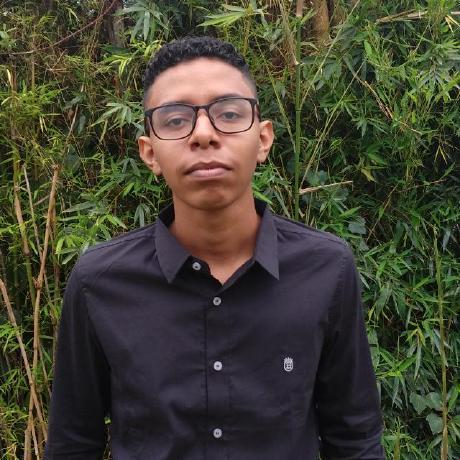
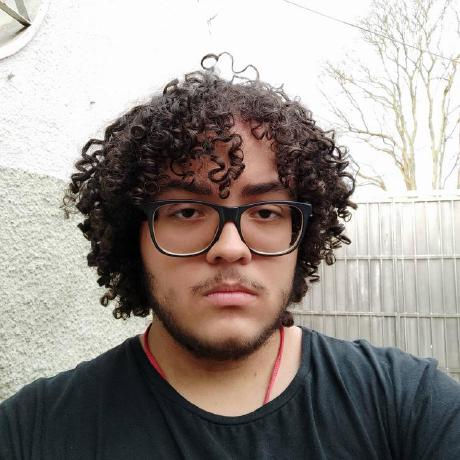
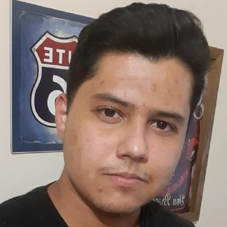

# Página Inicial - Grupo 4

## Informações sobre o Projeto

Este repositório está destinado ao desenvolvimento da documentação do projeto da disciplina de Requisitos de Software, ministrada pelo professor André Barros de Sales, na Universidade de Brasília - FGA, durante o período 2023.1. Esse projeto tem como principal objetivo analisar o aplicativo escolhido e utilizar técnicas de elicitação e modelagem de requisitos.

## Informações sobre o Aplicativo 

## Colaboradores

| Foto                                                  | Nome | GitHub                                              |
| ----------------------------------------------------- | ----- | --------------------------------------------------- |
|  | Chaydson Ferreira | [@chaydson](https://github.com/chaydson)           |
|  | Gabriel Ferreira  | [@oo7gabriel](https://github.com/oo7gabriel)       |
| | Henrique Pucci    | [@HenriPucci](https://github.com/HenriPucci)                                         |
| | Lucas Frazão  | [@LucasLopesFrazao](https://github.com/LucasLopesFrazao)     |
| | Pedro Henrique     | [@PedroHenrique2077](https://github.com/PedroHenrique2077) |
|  | Samuel Gomes      | [@SamuelGSouza](https://github.com/SamuelGSouza)         |

## Histórico de Versão
| Versão | Data       | Descrição            | Autor(es) | Revisor(es) |
|--------|------------|----------------------|-----------|-------------|
| 1.0    | 07/04/2023 | Criação Página Inicial | Henrique     | ...         |