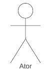
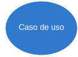
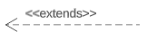
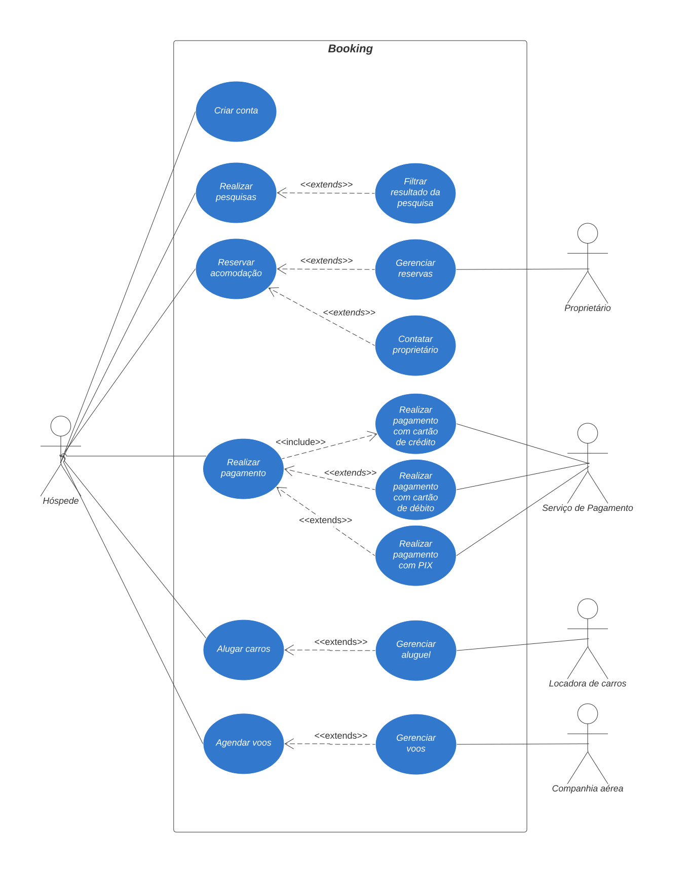

# Casos de uso

## Introdução

Um diagrama de casos de uso é uma ferramenta que permite representar graficamente as interações entre os usuários e um sistema. Ele mostra quais são os atores envolvidos, quais são os cenários possíveis e quais são os objetivos que o sistema deve atender. Um diagrama de casos de uso é composto por elementos como atores, casos de uso, relacionamentos e limites do sistema. Ele faz parte da linguagem de modelagem unificada (UML), que é um padrão para especificar e documentar sistemas de software.

## Metodologia

O diagrama de casos de uso foi elaborado a partir dos principais requisitos identificados através dos métodos de brainstorming, observação e storytelling. Posteriormente, o diagrama foi validado por um participante que interpretou o papel do cliente e não possuía vínculo com o grupo.

## Componentes

A Tabela 1 fornece uma visão geral dos componentes de um diagrama de caso de uso e sua descrição.

| Componente                                                         | Descrição                                                                               |
| ------------------------------------------------------------------ | ----------------------------------------------------------------------------------------- |
|                               | Representa um usuário ou sistema externo que interage com o sistema em questão.         |
|                    | Descreve uma funcionalidade do sistema que atende a uma necessidade do usuário.          |
|  | Conecta o ator ao caso de uso correspondente.                                             |
|                          | Indica que um caso de uso é incluído em outro caso de uso.                              |
|                          | Indica que um caso de uso pode ser estendido por outro caso de uso em certas condições. |

 Tabela 1: Componentes do Diagrama de Casos de Uso (Fonte: Autor, 2023). 

## Digrama de Casos de Uso

A Figura 1 mostra o diagrama de casos de uso do sistema do aplicativo Booking.

 Figura 1: Diagrama de Casos de Uso (Fonte: Autor, 2023). 

## Especificação do diagrama de caso de uso

As informações contidas nas especificações do diagrama de caso de uso são essenciais para o sucesso do processo de desenvolvimento de software. Elas apresentam detalhes sobre os atores envolvidos, suas funções e interações com o sistema, além de fornecer descrições minuciosas dos casos de uso e suas relações com outros casos de uso.

### Legenda

UC: Use Case (caso de uso)

FST: Requisito funcional de Storytelling

FOBS: Requisito funcional da Observação

FB - Requisito Funcional Brainstorm

### UC01 - Criar conta

As especificações para o caso de uso "criar conta" são apresentadas na Tabela 1.

| UC01                            | Criar conta                                                                                                                                                                                                                                        |
| ------------------------------- | -------------------------------------------------------------------------------------------------------------------------------------------------------------------------------------------------------------------------------------------------- |
| **Ator**                  | Hóspede                                                                                                                                                                                                                                           |
| **Requisitos**            | O Hóspede deve fornecer informações pessoais e de contato válidas.                                                                                                                                                                             |
| **Condição de entrada** | O Hóspede acessa a página de registro do sistema.                                                                                                                                                                                                |
| **Fluxo principal**       | 1. O Hóspede preenche o formulário de registro com suas informações pessoais e de contato. 2. O Hóspede confirma as informações e envia o formulário. 3. O sistema verifica as informações e cria uma conta para o Hóspede. |
| **Fluxos alternativos**   | 3a. Se as informações fornecidas pelo Hóspede são inválidas ou incompletas, o sistema exibe uma mensagem de erro e solicita que o Hóspede corrija o formulário.                                                                             |
| **Fluxos de exceção**   | Nenhum.                                                                                                                                                                                                                                            |
| **Pós-condição**       | O Hóspede tem uma conta registrada no sistema.                                                                                                                                                                                                    |
| **Rastreabilidade**       | [FST01](../elicitacao/storytelling.md)                                                                                                                                                                                                                |

 Tabela 1: especificações para o caso de uso "criar conta" (Fonte: Autor, 2023). 

