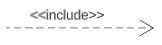

# Casos de uso

## Introdução

Um diagrama de casos de uso é uma ferramenta que permite representar graficamente as interações entre os usuários e um sistema. Ele mostra quais são os atores envolvidos, quais são os cenários possíveis e quais são os objetivos que o sistema deve atender. Um diagrama de casos de uso é composto por elementos como atores, casos de uso, relacionamentos e limites do sistema. Ele faz parte da linguagem de modelagem unificada (UML), que é um padrão para especificar e documentar sistemas de software.

## Metodologia

O diagrama de casos de uso foi elaborado a partir dos principais requisitos identificados através dos métodos de brainstorming, observação e storytelling. Posteriormente, o diagrama foi validado por um participante que interpretou o papel do cliente e não possuía vínculo com o grupo.

## Componentes

A Tabela 1 fornece uma visão geral dos componentes de um diagrama de caso de uso e sua descrição.

| Componente                                                         | Descrição                                                                               |
| ------------------------------------------------------------------ | ----------------------------------------------------------------------------------------- |
|                               | Representa um usuário ou sistema externo que interage com o sistema em questão.         |
|                    | Descreve uma funcionalidade do sistema que atende a uma necessidade do usuário.          |
|  | Conecta o ator ao caso de uso correspondente.                                             |
|                          | Indica que um caso de uso é incluído em outro caso de uso.                              |
|                          | Indica que um caso de uso pode ser estendido por outro caso de uso em certas condições. |

 Tabela 1: Componentes do Diagrama de Casos de Uso (Fonte: Autor, 2023). 

## Digrama de Casos de Uso

A Figura 1 mostra o diagrama de casos de uso do sistema do aplicativo Booking.

 Figura 1: Diagrama de Casos de Uso (Fonte: Autor, 2023). 

