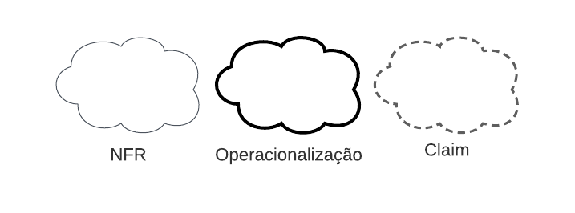

# NFR Framework

## Introdução

O NFR Framework é uma abordagem para analisar e representar Requisitos Não-Funcionais. Ele ajuda os desenvolvedores a implementar soluções personalizadas, levando em conta as características do sistema e do domínio em questão. Isso inclui Requisitos Não-Funcionais, Requisitos Funcionais, prioridades e carga de trabalho. Esses fatores influenciam a escolha de alternativas de desenvolvimento para um sistema específico (CHUNG et al., 2000).

O principal objetivo do framework é fornecer uma estrutura para armazenar o desenho e o raciocínio do processo de desenvolvimento de requisitos através de grafos chamados Softgoal Interdependency Graphs (SIGs). Eles armazenam as considerações do desenvolvedor sobre os requisitos e mostram a interdependência entre eles.

## Softgoals

- Softgoal NFR: São características abstratas que são postas a análises visando saber se a mesma será cumprida ou não, ou seja, será escolhida ou não para ser implementada. No fundo, são requisitos não funcionais categorizados em critérios/atributos de qualidade.
- Softgoal de Operacionalização: Representam as funcionalidades como uma forma concreta de viabilizar ou não as características abstratas.
- Softgoal de Afirmação: Aqui entram as características externas de cada softgoal, ou seja, são consideradas e refletidas na decisão, justificando a priorização do softgoal.

Figura 1 - Legenda de Softgoals.(Fonte: Autores. 2023).

## Contribuições

As contribuições representam como um softgoal descendente contribui para a satisfação de um softgoal ascendente, podendo ser positivas ou negativas, ou até mesmo satisfazendo por completo o ascendente.

Tipos de contribuições utilizadas pelo framework:

- AND: O ascendente é satisfeito se somente se todos os descendentes forem satisfeitos
- OR: O ascendente é satisfeito se um dos descendentes for satisfeito
- MAKE(++): O descendente com contribuição tão positiva a ponto de satisfazer o ascendente
- BREAK(--): O descendente com contribuição tão negativa a ponto de negar o ascendente
- HELP(+): O descendente com contribuição positiva parcial, que sozinho não satisfaz o ascendente
- HURT(-): O descendente com contribuição negativa parcial, que sozinha não chega a negar o ascendente
- UNKNOWN: O ascendente não afeta o pai
- EQUAL: Determina que o softgoal descendente só será satisfeito se o softgoal ascendente for satisfeito e que softgoal descendente será negado se o softgoal ascendente for negado.
- SOME(+/-): O descendente com contribuição (positiva ou negativa), onde a intensidade não se pode determinar

## Cartões de Especiicação

