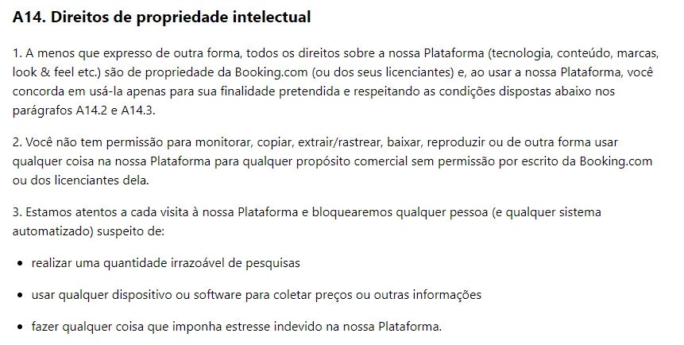

## Introdução

Bem-vindo à página do aplicativo selecionado. Aqui serão apresentados os detalhes do aplicativo escolhido dentre a [lista de aplicativos](aplicativosAnalisados.md).

## Qual foi o aplicativo selecionado?

O aplicativo escolhido é o booking, que oferece diversas opções de hospedagem, desde hotéis, apartamentos, resorts e pousadas, até aluguéis de carros e pacotes de viagem completos. Ele pode ser encontrado tanto na Play Store quanto na App Store. Para saber mais detalhes consulte a [lista de aplicativos](aplicativosAnalisados.md).

## Por que foi escolhido o Booking?

O aplicativo Booking foi escolhido para o projeto na disciplina de requisitos de software devido à sua grande popularidade e ampla utilização em todo o mundo. Com uma ampla gama de acomodações disponíveis em diferentes países e cidades, ele oferece uma variedade de funcionalidades e recursos, incluindo pesquisa e reserva de acomodações, gerenciamento de reservas, suporte ao cliente e muito mais. Estudar os requisitos de software de um aplicativo tão complexo pode ser uma oportunidade valiosa para aprender técnicas de elicitação e análise de requisitos, bem como desenvolver habilidades em gerenciamento de projetos de software e boas práticas de engenharia de software. Portanto, o Booking pode ser um desafio significativo e uma oportunidade de aplicar conceitos e metodologias aprendidos na disciplina de requisitos de software.

## Imagens do aplicativo

 Figura 1: Imagens do aplicativo (Fonte: Apple store, 2023). 

Disponível em: [Apple Store](https://apps.apple.com/br/app/ofertas-de-viagem-booking-com/id367003839)

## Direito de Uso ou Propriedade Intelectual

O aplicativo do Booking, possui uma politica de uso, no seus termos, sendo localizado em seu site, pode ser localizado no termo A14(A14.2 e A14.3), que  as únicas restrições quanto ao uso da plataforma do Booking.com referece a proibição do uso comercial do mesmo, sem a expressa autorização assinada de pessoas licenciadas ou do próprio booking.com, o nosso objetivo é apenas de apredizado, ficando claro que o projeto não tem nenhum objetivo comercial apenas de aprendizado. Abaixo está imagem dos termos encontrados e nas referências bibliográficas o link para site do mesmo.

 Figura 2: Direito de Propriedade Intelectual (Fonte: Booking.com, 2023). 

## Referências Bibliográfica

[1] Termos e Condições do Bookinkg.com. https://www.booking.com/content/terms.pt-br.html.Acesso em 20 de abril de 2023.

## Histórico de Versão

| Versão | Data       | Descrição            | Autor(es)    | Revisor(es) |
| ------- | ---------- | ---------------------- | ------------ | ----------- |
| 1.0     | 11/05/2023 | Criação do documento | Samuel Gomes | Lucas Lopes |
| 1.1     | 20/04/2023 | Atualização da Escolha | Gabriel      | Lucas       |
| 1.2     | 20/04/2023 | Adicionando legendas nas imagens                  | Lucas     | Henrique       |

