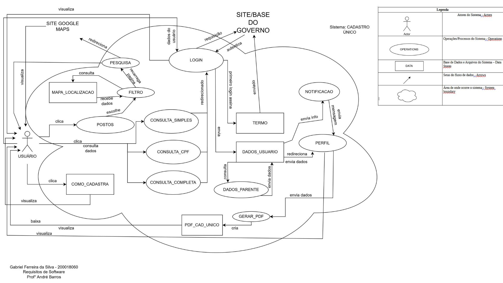

# Introdução

Seja bem-vindo à página de aplicativos analisados! Aqui, você encontrará uma lista completa de aplicativos avaliados pelo nosso grupo, juntamente com descrições detalhadas de cada um deles, bem como ilustrações na forma de rich picture para ajudar na visualização e compreensão.

## Booking

### Descrição do aplicativo

O Booking é um aplicativo de reserva de acomodações e viagens disponível para iOS e Android. Com uma interface fácil de usar, os usuários podem pesquisar e reservar hotéis, resorts, apartamentos, casas de temporada, albergues e outros tipos de acomodações em todo o mundo. Além disso, o aplicativo oferece a opção de reservar voos, aluguéis de carros e atividades turísticas. O Booking fornece avaliações de clientes e fotos dos alojamentos para ajudar os usuários a tomarem decisões informadas sobre onde ficar.

### Rich Picture

Autor: Lucas Lopes

### Mais Informações

Google Play: [Clique aqui](https://play.google.com/store/apps/details?id=com.booking&hl=pt_BR&gl=US)

App Store: [Clique aqui](https://apps.apple.com/br/app/ofertas-de-viagem-booking-com/id367003839)

## Cadastro Único

### Descrição do aplicativo

O Cadastro Único (CadÚnico) é um aplicativo criado pelo Governo Federal do Brasil com o objetivo de reunir informações de famílias de baixa renda e em situação de vulnerabilidade social, para que possam ter acesso a programas sociais do governo, como o Bolsa Família, por exemplo. O aplicativo permite que as famílias se cadastrem ou atualizem seus dados, informando informações pessoais, renda, moradia, escolaridade e outras informações relevantes. Além disso, o CadÚnico também é utilizado pelos governos estaduais e municipais para identificar as demandas da população mais carente e direcionar recursos e políticas públicas de forma mais eficiente. O aplicativo é uma importante ferramenta de inclusão social e combate à pobreza no Brasil.

### Rich Picture

Autor: Gabriel Ferreira

### Mais informações

Google Play: [Clique aqui](https://play.google.com/store/apps/details?id=br.gov.dataprev.meucadunico&hl=pt_BR&gl=US)

App Store: [Clique aqui](https://apps.apple.com/br/app/cadastro-%C3%BAnico/id1605659516)

