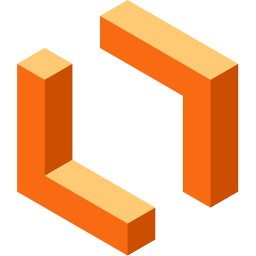

# Introdução

Bem-vindo à página de ferramentas do projeto! Aqui você encontrará uma lista de ferramentas e recursos que serão utilizados ao longo do desenvolvimento do projeto. Essas ferramentas foram selecionadas para ajudar a maximizar a eficiência e a qualidade do projeto, tornando o processo de desenvolvimento mais ágil e eficaz. Cada ferramenta listada nesta página tem um propósito específico e irá desempenhar um papel importante em todo o processo.

# Ferramentas

As ferramentas que iremos utilizar estão ilustradas na tabela 1 a seguir:

| Logo                                                          | Descrição                                                                                                                                                                                     |
| ------------------------------------------------------------- | ----------------------------------------------------------------------------------------------------------------------------------------------------------------------------------------------- |
| <figure></figure>         | O GitHub é usado para hospedar o projeto em um repositório público.                                                                                                                          |
|             | O Git é usado para controlar as versões do projeto.                                                                                                                                           |
|        | O Telegram é usado para a comunicação entre os colaboradores do projeto.                                                                                                                     |
|         | O Discord é usado para a comunicação por voz e texto entre os colaboradores do projeto.                                                                                                      |
|          | O MkDocs é usado para criar documentação de projetos em formato HTML ou outros formatos, a partir de arquivos em formato Markdown                                                            |
|  | É um tema de documentação para o MkDocs que oferece uma aparência moderna e responsiva para a documentação do projeto.                                                                    |
|                                                               | O Teams é um aplicativo web e app para realizar reuniões de pessoas desenvolvida pela microsoft, sendo utilizada no projeto como principal ferramenta para a reunião semanal e gravações |
|                                                               | O Officer Viewer(Markdown Editor) é uma extensão do Visual Studio Code utilizada para editar de maneira mais fácil documento com extensão  .md(markdown)                                  |
|  | O VsCode é  usado para editar o código markdown que gera a página.                                                                 |
|  | O YouTube é o site pelo qual o grupo hospeda as gravações.                                                                     |
|  | O Lucidchart é usado para fazer a diagramação e visualização de informações.                                                                     |
|  | O WhiteBoard é usado fazer diagramas e organizar informações.                                                                     |

Tabela 1: Ferramentas

# Referências 

Build software better, together. Disponível em: <https://github.com/>. Acesso em: 19 abr. 2023.

Git. Disponível em: <https://git-scm.com/>. Acesso em: 19 abr. 2023.

TELEGRAM FZ-LLC. Telegram. Disponível em: <https://play.google.com/store/apps/details?id=org.telegram.messenger&hl=pt_BR&gl=US>. Acesso em: 19 abr. 2023.

‌DISCORD. Seu Lugar para Papear e Ficar De Boa. Disponível em: <https://discord.com/>. Acesso em: 19 abr. 2023.

TEAM, M. MkDocs. Disponível em: <https://www.mkdocs.org/>. Acesso em: 19 abr. 2023.

DONATH, M. Material for MkDocs. Disponível em: <https://squidfunk.github.io/mkdocs-material/>. Acesso em: 19 abr. 2023.

‌Entrar | Microsoft Teams. Disponível em: <https://www.microsoft.com/pt-br/microsoft-teams/log-in>. Acesso em: 19 abr. 2023.

‌Office Viewer(Markdown Editor) - Visual Studio Marketplace. Disponível em: <https://marketplace.visualstudio.com/items?itemName=cweijan.vscode-office>. Acesso em: 19 abr. 2023.

‌MICROSOFT. Visual Studio Code. Disponível em: <https://code.visualstudio.com/>. Acesso em: 19 abr. 2023.

‌FRTTT, M. YouTube. YouTube, 2023. Disponível em: <https://www.youtube.com/>. Acesso em: 19 abr. 2023.

Software online de diagramas e comunicação visual | Lucidchart. Disponível em: <https://8x5z.short.gy/57q6ln>. Acesso em: 19 abr. 2023.

Microsoft White Board | Quadro Interativo| App Lousa Digital. Disponível em: <https://www.microsoft.com/pt-br/microsoft-365/microsoft-whiteboard/digital-whiteboard-app>. Acesso em: 19 abr. 2023.

‌

‌
‌
‌
# Histórico de Versão

| Versão | Data       | Descrição                             | Autor(es)      | Revisor(es) |
| ------- | ---------- | --------------------------------------- | -------------- | ----------- |
| 1.0     | 07/04/2023 | Criação da página de ferramentas     | Pedro Henrique | Chaydson    |
| 1.1     | 17/04/2023 | Atualização de Ferramentas Utilizadas | Gabriel        | ---         |
| 1.2     | 19/04/2023 | Adicionando mais ferramentas e referências | Pedro Henrique        | Samuel         |
