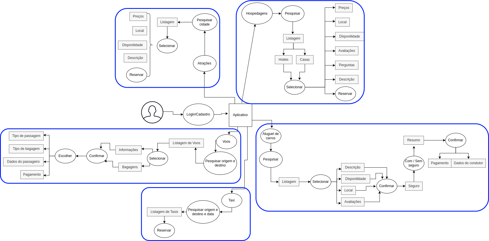
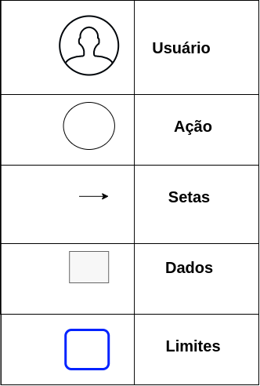
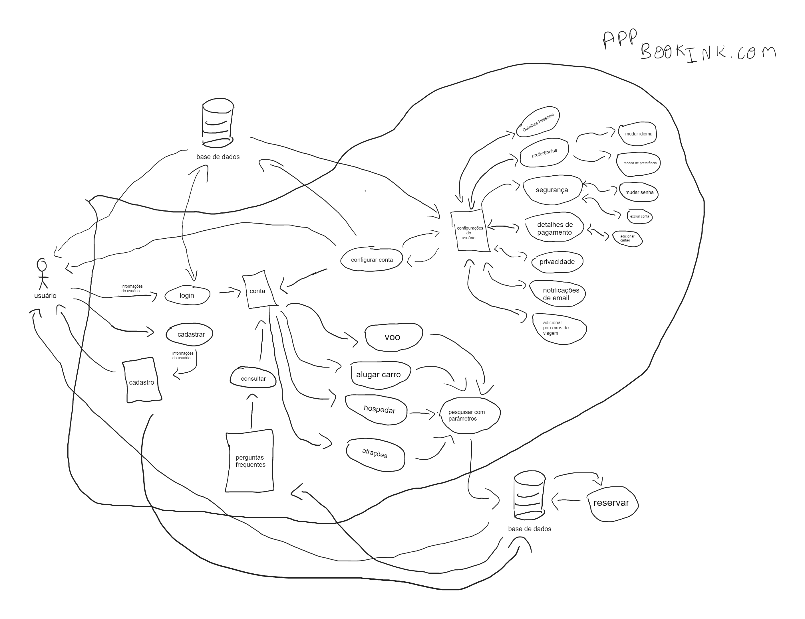
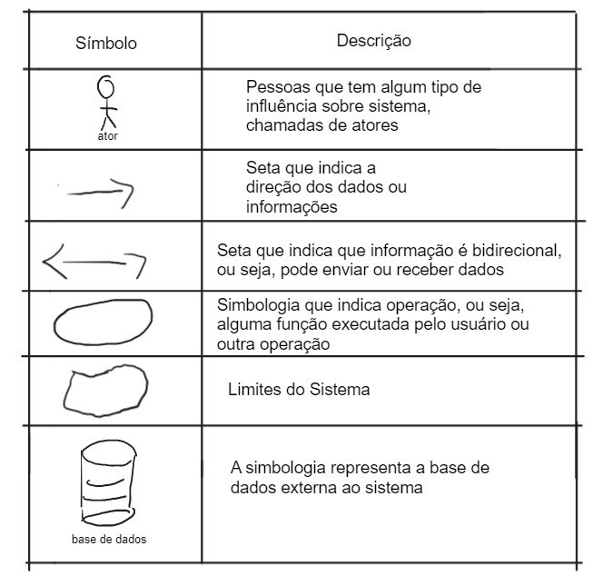

# Rich Picture

## O que é

O Rich Picture é uma ferramenta valiosa para analisar problemas e comunicar ideias de forma clara e visual. Quando se trata de resolver um problema de negócios, é fundamental compreender os componentes essenciais da situação. O Rich Picture pode ajudar a identificar esses elementos cruciais, criando um esboço gráfico que inclui imagens, texto, símbolos e ícones. Esses elementos são usados para ilustrar os principais aspectos do problema, incluindo processos, requisitos de dados, atores envolvidos, responsabilidades e relações entre esses elementos. O resultado é uma representação visual detalhada que ajuda a aprender sobre problemas complexos ou mal definidos. Através do uso de Rich Pictures, é possível identificar potenciais problemas e conflitos, tornando mais fácil desenvolver soluções eficazes.

Abaixo, na Figura 1, podemos ver a primeira versão do Rich Picture, seguido de sua legenda na Figura 2, feito para a análise do aplicativo que foi selecionado pela equipe.

## Versão 1

Clique na imagem para ser redirecionando ao site imgur e ver a imagem em tamanho maior.

 Figura 1: Rich Picture do aplicativo Booking (Fonte: Lucas, 2023). 

### Legenda

 Figura 2: Legenda do Rich Picture do aplicativo Booking (Fonte: Lucas, 2023). 

Contudo, após maiores análises sobre o aplicativo, e seu respectivo Rich Picture anteriormente feito (versão 1), foi feito uma segunda versão do Rich Picture pós maiores análises do aplicaivo pela equipe. Essa nova versão está representadda na Figura 3, seguida de sua legenda na Figura 4.

## Versão 2

 Figura 3: Rich Picture melhotado do aplicativo Booking (Fonte: Autores, 2023). 

### Legenda

 Figura 4: Legenda do Rich Picture melhorado do aplicativo Booking (Fonte: Autores, 2023). 

## Bibliografia

[1] Slides da aula “Requisitos – Aula 04” dos professores Milene Serrano e Maurício Serrano, Acessado em: 06 de abril de 2023.

[2] Projeto Lichess do github de requisitos de software - disponível [aqui](https://requisitos-de-software.github.io/2022.2-Lichess/prerastreabilidade/richpicture/), Acessado em: 10 de abril de 2023.

[3] IHC - Design Conceitual - Rich Picture - Livro: David Benyon, Interação Humano-Computador. São Paulo, 2a Edição, Acessado em: 06 de abril de 2023.

## Histórico de Versão

| Versão | Data       | Descrição            | Autor(es)       | Revisor(es) |
| ------- | ---------- | ---------------------- | --------------- | ----------- |
| 1.0     | 10/04/2023 | Criação do documento | Lucas e Gabriel | Henrique    |
| 1.1     | 14/04/2023 | Atualização          | Gabriel e Lucas | Pedro       |
| 1.2     | 20/04/2023 | Adicionando legendas nas imagems| Lucas | Henrique       |
| 1.3     | 23/04/2023 | Adicionando descrição para imagens| Henrique  |  Lucas     |
